 ## Part 1. Настройка **gitlab-runner**  
- Утсановим gitlab-runner на Ubuntu 22.04:
	- `curl -L "https://packages.gitlab.com/install/repositories/runner/gitlab-runner/script.deb.sh" | sudo bash`
	- `sudo apt-get install gitlab-runner`
- Запусти **gitlab-runner** и зарегистрируй его для использования в текущем проекте (DO6_CICD).

	-  Для регистрации понадобятся URL и токен, которые можно получить на страничке задания на платформе.
	- `sudo gitlab-runner start`
	- `sudo gitlab-runner register`
	-  Вводим наш адрес и токен
	-  Выберем исполнителя `shell`
	-  Видим что всё работает  
		- 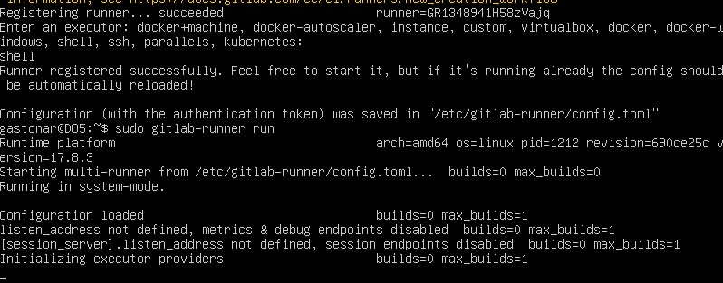

 ## Part 2. Сборка
- Напишем этап для CI по сборке приложений из проекта C2_SimpleBashUtils.
- В файле gitlab-ci.yml добавим этап запуска сборки через мейк файл из проекта C2.
- Файлы, полученные после сборки (артефакты), сохраним в произвольную директорию со сроком хранения 30 дней.
	- 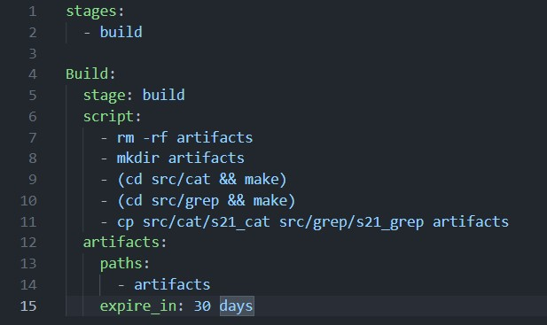
	- 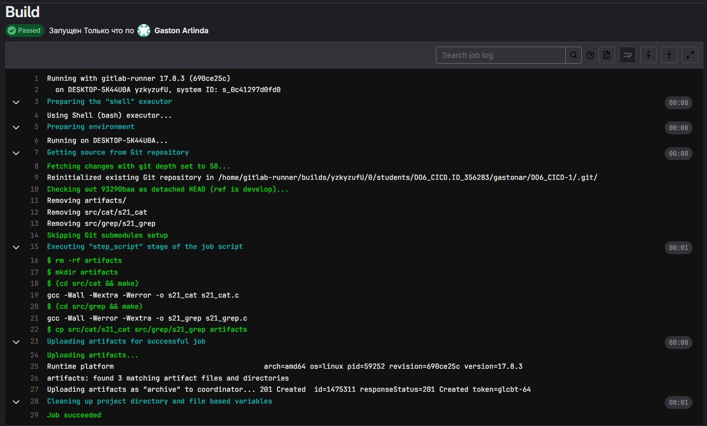

 ## Part 3. Тест кодстайла
- Напишем этап для CI, который запускает скрипт кодстайла (clang-format).
- Если кодстайл не прошел, то «зафейлим» пайплайн.
- В пайплайне отобрази вывод утилиты clang-format.
	- 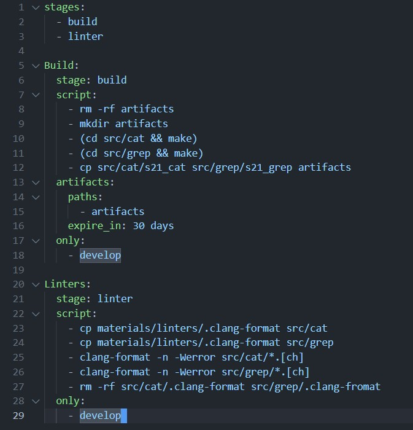
	- 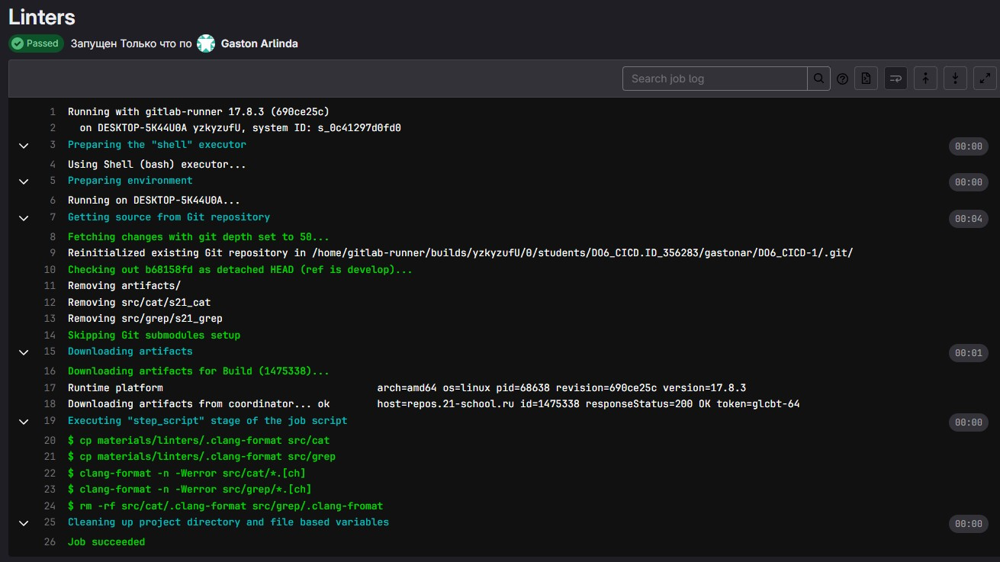
	- 

 ## Part 4. Интеграционные тесты
- Напишем этап для CI, который запустит интеграционные тесты.
- Запустим этот этап автоматически только при условии, если сборка и тест кодстайла прошли успешно.
- Если тесты не прошли, то «зафейлим» пайплайн.
- В пайплайне отобразим вывод, что интеграционные тесты успешно прошли / провалились.
	- 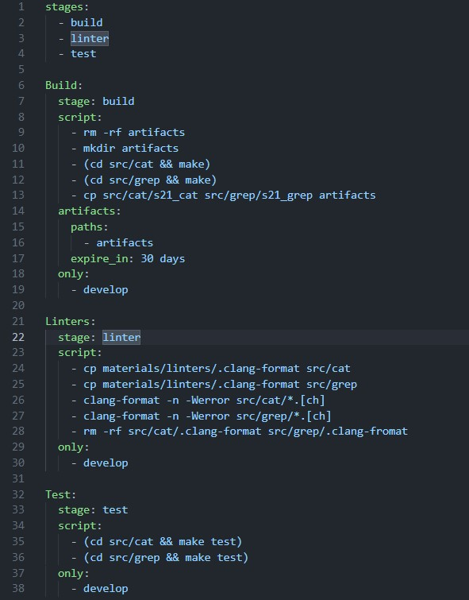
	- 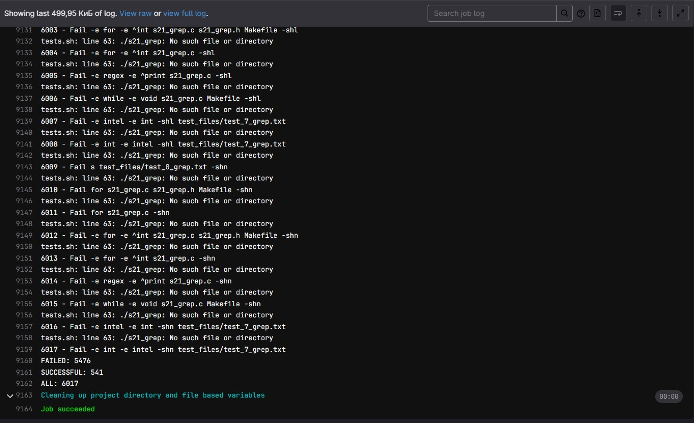

 ## Part 5. Этап деплоя
- Клонируем виртуальную машину
- Настраиваем сеть (между двумя серверами)
- Переходим в юзера gitlab-runner `su gitlab-runner` (На первом оригинальном сервере)
- На нём генерируем ключ ssh `ssh-keygen`
- Пробрасываем ключ второму серверу `ssh-copy-id gastonar@10.10.0.2`
- Даём gitlab-runner больше прав `sudo usermod -aG sudo gitlab-runner` (На первом оригинальном сервере)
- На втором сервере (склонированном) даём права к директории /usr/local/bin `chmod 777 /usr/local/bin`
- Настраиваем все файлы
	- 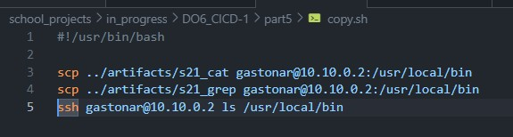
	- 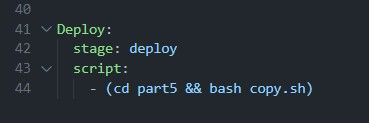
	- 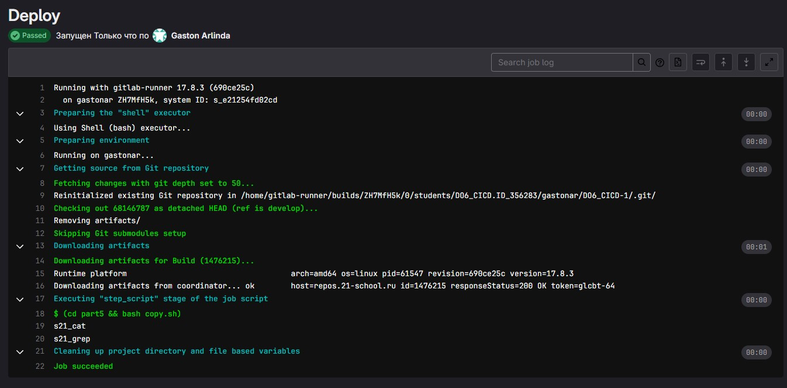

 ## Part 6. Дополнительно. Уведомления

- `notify.sh`
 	- 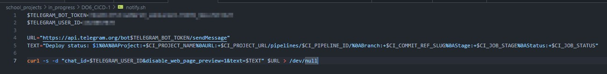

- `.gitlab-ci.yml`
	- 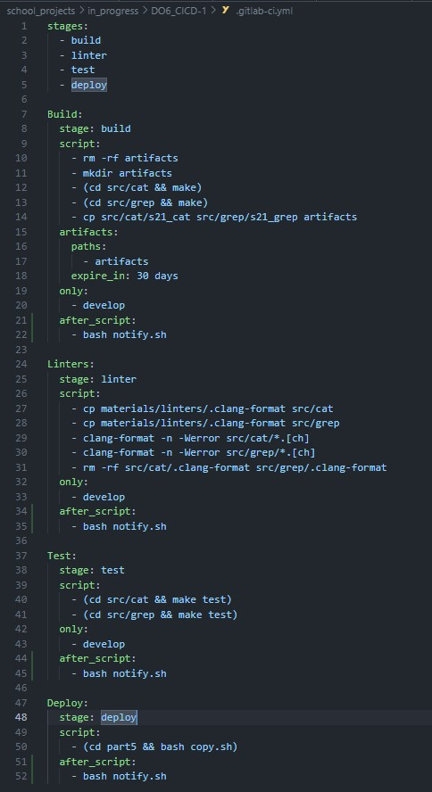

- tg-bot
	- 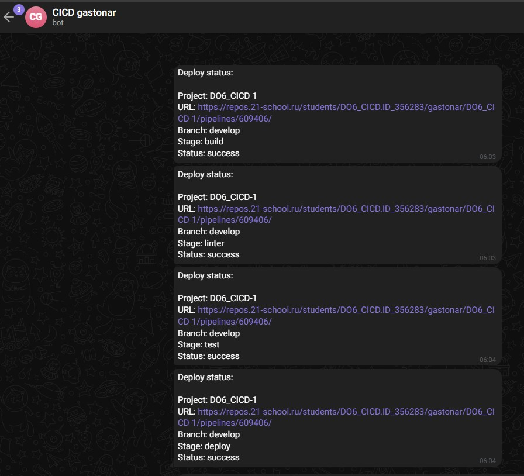